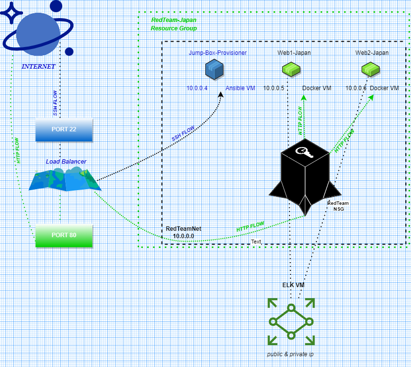

## Automated ELK Stack Deployment

The files in this repository were used to configure the network depicted below.

These files have been tested and used to generate a live ELK deployment on Azure. They can be used to either recreate the entire deployment pictured above. Alternatively, select portions of the yml file may be used to install only certain pieces of it, such as Filebeat.
---
  - name: Config ELK VM with Docker
    hosts: elk
    remote_user: RedTeammate
    become: true
    tasks:

    - name: Use More Memory
      sysctl:
        name: vm.max_map_count
        value: '262144'
        state: present
        reload: yes

    - name: Install docker.io
      apt:
        update_cache: yes
        name: docker.io
        state: present

    - name: Install pip3
      apt:
        name: python3-pip
        state: present

    - name: Install Python Docker Module
      pip:
        name: docker
        state: present

    - name: download and launch a docker elk container
      docker_container:
        name: elk
        image: sebp/elk:761
        state: started
        restart_policy: always
        published_ports:
          - 5601:5601
          - 9200:9200
          - 5044:5044

  
This document contains the following details:
- Description of the Topologu
- Access Policies
- ELK Configuration
  - Beats in Use
  - Machines Being Monitored
- How to Use the Ansible Build

### Description of the Topology

The main purpose of this network is to expose a load-balanced and monitored instance of DVWA, the D*mn Vulnerable Web Application.

Load balancing ensures that the application will be highly available, in addition to restricting access to the network.
-What aspect of security do load balancers protect? What is the advantage of a jump box?
-Load balancers distribute incoming network traffic to the appropiate server. Load balancers assist with reducing response time, and makes the overall 
browsing experience smoother for the user. On the other hand, a jump box serves as a bridge between two trusted networks; and acting as the only point of entry 
to the network; it ensures controlled access either through SSH or RDP.  

Integrating an ELK server allows users to easily monitor the vulnerable VMs for changes to the data and system logs.
- What does Filebeat watch for?
- Filebeat is resposible for monitoring, gathering, and displaying log data. 
-What does Metricbeat record?
- Metricbeat assists in monitoring, and providing the metrics of the systems and services that the server is hosting.

The configuration details of each machine may be found below.
_Note: Use the [Markdown Table Generator](http://www.tablesgenerator.com/markdown_tables) to add/remove values from the table_.

| Name     | Function | IP Address   | Operating System |
|----------|----------|--------------|------------------|
|Jump-Box-
Provisioner| Gateway  | 20.222.0.241 | Linux            |
|Web1 Japan| webserver|52.140.192.229| Linux            |
|Web2 Japan| webserver|52.140.192.229| Linux            |
|ELK-SERVER| kibana   | 20.89.250.91 | Linux            |
|Red-TeamLB| LB       |52.140.192.229| DVWA             |
### Access Policies

The machines on the internal network are not exposed to the public Internet. 

Only the Jump-Box machine can accept connections from the Internet. Access to this machine is only allowed from the following IP addresses:
- _TODO: 20.222.0.241
         10.0.0.1
Machines within the network can only be accessed by SSH.
Which machine did you allow to access your ELK VM? What was its IP address?
- I allowed the Jump-Box-Provisioner to have access to my ELK VM - 10.0.0.1
A summary of the access policies in place can be found in the table below.

| Name     | Publicly Accessible | Allowed IP Addresses |
|----------|---------------------|----------------------|
| Jump Box |       Yes           |      10.0.0.1        |
|ELK-SERVER|       Yes           |    40.74.90.236      |
|   DVWA   |       No            |      10.0.0.5        |

### Elk Configuration

Ansible was used to automate configuration of the ELK machine. No configuration was performed manually, which is advantageous because...
- _TODO: What is the main advantage of automating configuration with Ansible?_
-Automating configurations through ansible rejects the manual approach to updating and transferring logs, which in turn creates consistensy in the documenting of such sensitive data. Ansible also allows the visualization of such data to be influenced and reflected based off what's needed, which is where lightweight shippers such as Filebeat & Metricbeat come into play.
The playbook implements the following tasks:
- The ELK Stack I constructed and configured is made up of: Elasticsearch, Logstash, and Kibana. Three open-source tools that are used to concise logs into one place, facilitating the ability to group them, supervise the activity on them, and thus identify any problems with the server or its applications. I crafted my ELK Stack through Ansible, as it allows for the automated initiation, configuration, and management of machines, shifting full control to a singular remote location. Initially, I used Vagrant to ssh into the Jumpbox I had previously created in Azure. I continued by setting up my ansible playbook, making sure it connected to my ELK VM properly, and looking over its structure to ensure the order of my script, and overall spacing was appropriate for the playbook to install ELK stack smoothly. That imperative security between Ansible and my virtual machine is one of the biggest obstacles I ran across, but after troubleshooting, and reviewing both the ansible playlist & ansible configuration file, I slowed down until realizing my Ansible ssh password was what needed to be attached to my server. Once I did that, I was able to start up my docker and my run ansible-playbook. All in all, I successfully set up ELK Stack, and am now able to monitor and manage my server. 

The following screenshot displays the result of running `docker ps` after successfully configuring the ELK instance.

https://user-images.githubusercontent.com/106292123/171785336-9f99981e-46e2-49ae-8ea8-b5ecee03257a.JPG

### Target Machines & Beats
This ELK server is configured to monitor the following machines:
- _TODO: Web1-Japan: 52.140.192.229
         Web2-Japan: 52.140.192.229

We have installed the following Beats on these machines:
- _TODO: Filebeat
         Metricbeat

These Beats allow us to collect the following information from each machine:
- _TODO: In 1-2 sentences, explain what kind of data each beat collects, and provide 1 example of what you expect to see. E.g., `Winlogbeat` collects Windows logs, which we use to track user logon events, etc._
- -Both beats are described as lightweight shippers, and while their functions differ, they are both imperative for the delivery and supervision of log files. Filebeat is constantly either retrieving log files, scanning the location of such logs, or shipping them out. So while filebeat is in charge of centralizing 
the data, metricbeat focuses on the statistics surrounding the system and services running. 

### Using the Playbook
In order to use the playbook, you will need to have an Ansible control node already configured. Assuming you have such a control node provisioned: 

SSH into the control node and follow the steps below:
- Copy the _____ file to _____.
- Update the _____ file to include...
- Run the playbook, and navigate to ____ to check that the installation worked as expected.

_TODO: Answer the following questions to fill in the blanks:_
- _Which file is the playbook? Where do you copy it?_
- _Which file do you update to make Ansible run the playbook on a specific machine? How do I specify which machine to install the ELK server on versus which to install Filebeat on?_
- _Which URL do you navigate to in order to check that the ELK server is running?

_As a **Bonus**, provide the specific commands the user will need to run to download the playbook, update the files, etc._
